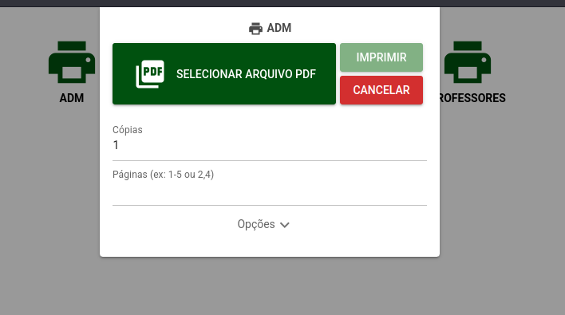

# SysPrint



## Passo a passo de utilização

### 1. Instalar o Docker Compose

Siga as instruções oficiais para instalar o Docker Compose: [Docker Compose Installation](https://docs.docker.com/compose/install/)

### 2. Dar permissão de execução ao script `./start.sh`

No terminal, navegue até a raiz do projeto e execute o comando:

```sh
chmod +x ./start.sh
```

### 3. Iniciar o projeto

Execute o script `./start.sh` para iniciar o projeto:

```sh
./start.sh
```

### 4. Instalar a impressora

Você pode instalar a impressora de duas maneiras:

#### Usando o CUPS na porta 631

Acesse o CUPS através do navegador em `http://localhost:631` e siga as instruções para adicionar uma nova impressora.

#### Usando o terminal

No terminal, execute o comando para acessar o container do servidor:

```sh
docker-compose exec sysprint-server /bin/bash
```

Dentro do container, execute o comando para configurar a impressora (exemplo para impressoras HP):

```sh
hp-setup -i <ip>
```
